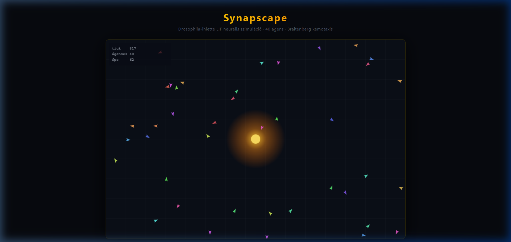

# Synapscape

> **High-performance artificial life simulation running biological Leaky Integrate-and-Fire (LIF) neural circuits inside a dedicated Web Worker at 60 FPS. Inspired by the *Drosophila melanogaster* connectome (FlyWire project).**

[](https://www.typescriptlang.org/)
[](https://vitejs.dev/)
[](https://react.dev/)
[](https://opensource.org/licenses/MIT)
[](https://developer.mozilla.org/en-US/docs/Web/API/Web_Workers_API)



---

## Table of Contents

- [Overview](#overview)
- [Key Features](#key-features)
- [Architecture & Zero-Allocation Engine](#architecture--zero-allocation-engine)
- [Biological LIF & Neural Circuitry](#biological-lif--neural-circuitry)
  - [Leaky Integrate-and-Fire (LIF) Dynamics](#leaky-integrate-and-fire-lif-dynamics)
  - [Braitenberg Chemotaxis Reflex](#braitenberg-chemotaxis-reflex)
  - [Synaptic Plasticity (STDP)](#synaptic-plasticity-stdp)
- [Technology Stack](#technology-stack)
- [Directory Structure](#directory-structure)
- [Getting Started](#getting-started)
  - [Prerequisites](#prerequisites)
  - [Installation](#installation)
  - [Development & Scripts](#development--scripts)
- [Controls & Interactive HUD](#controls--interactive-hud)
- [Roadmap](#roadmap)
- [License](#license)

---

## Overview

**Synapscape** is a real-time, biologically grounded neuro-simulation that brings artificial life to the browser. Rather than relying on black-box artificial neural networks (ANNs) or abstract heuristic steering, each agent is governed by an individual **spiking neural network (SNN)** consisting of **Leaky Integrate-and-Fire (LIF)** neurons, modelled after the sensory-motor loops found in *Drosophila melanogaster* (fruit fly) neurobiology.

Agents continuously sample chemical concentration gradients using paired bilateral olfactory receptors (antennae), integrate currents through recurrent synaptic weights, fire discrete action potentials (spikes), and drive differential motors to navigate complex environments—all computed inside an isolated multi-threaded pipeline at a deterministic 60 Hz.

---

## Key Features

- **Biophysical Spiking Neurons:** Point-neuron LIF dynamics with membrane time constants ($\tau_m = 20\,\text{ms}$), refractory limits, and current integration.
- **Zero-Allocation Worker Pipeline:** The entire simulation loop executes off the main thread inside a Web Worker, serializing state across boundaries via **Transferable `ArrayBuffer`** payloads with zero GC overhead.
- **Braitenberg Chemotaxis:** Crossed bilateral antenna-to-motor projections produce emergent tropotactic odor tracking prior to synaptic tuning.
- **Spike-Timing-Dependent Plasticity (STDP):** Synapses adapt dynamically based on millisecond-level spike coincidence, reinforcing successful search trajectories.
- **Hardware-Accelerated 2D Canvas:** Ultra-lightweight rendering loop with visual scent field dissipation waves, heading-based agent hues, and an interactive heads-up display (HUD).

---

## Architecture & Zero-Allocation Engine

Browser-based simulations often suffer from periodic frame drops ("micro-stutters") caused by JavaScript Garbage Collection (GC) pauses when allocating transient objects during physics or neural network updates. Synapscape resolves this with a **zero-allocation, typed-memory architecture**:

```
 ┌─────────────────────────────────────────────────────────────┐
 │                      Main UI Thread                         │
 │                                                             │
 │  React 19 View ──> Canvas 2D Renderer (requestAnimationFrame) │
 │         ▲                                                   │
 └─────────┼───────────────────────────────────────────────────┘
           │  Transferable ArrayBuffer (Zero-Copy Transfer)
           ▼  [tick, x0, y0, angle0, x1, y1, angle1, ...]
 ┌─────────────────────────────────────────────────────────────┐
 │                   Dedicated Web Worker                      │
 │                                                             │
 │   Fixed 60 Hz Tick Loop (self.setTimeout / performance.now) │
 │                                                             │
 │   ┌────────────────────────┐    ┌────────────────────────┐  │
 │   │      AgentPool         │    │       LIFNetwork       │  │
 │   │  • Kinematics & Drag   │<──>│  • Membrane Integration│  │
 │   │  • Olfactory Receptors │    │  • Synaptic Matrix     │  │
 │   │  • Collision Sensors   │    │  • STDP Plasticity     │  │
 │   └────────────────────────┘    └────────────────────────┘  │
 │   Memory: Contiguous Float32Array & Uint8Array Buffers      │
 └─────────────────────────────────────────────────────────────┘
```

1. **Pre-Allocated Contiguous Typed Arrays:** All agent states (positions, velocities, angles, sensory activations) and network matrices (membrane potentials, timers, synaptic weights, spikes) reside in fixed-size `Float32Array` and `Uint8Array` buffers allocated once upon initialization.
2. **Transferable ArrayBuffer Ownership Transfer:** Instead of cloning structured JSON objects over `postMessage`, the worker transfers buffer ownership directly to the main thread. Memory is moved instantly without memory copying:
   ```ts
   (self as unknown as Worker).postMessage(out, [out.buffer]);
   ```
3. **Decoupled Simulation & Presentation:** The UI thread maintains 60+ FPS rendering completely independent of worker load, ensuring fluid user input and zero responsiveness degradation.

---

## Biological LIF & Neural Circuitry

### Leaky Integrate-and-Fire (LIF) Dynamics

The sub-threshold membrane potential $V(t)$ of each biological neuron is governed by the classic leaky integrator differential equation:

$$\tau_m \frac{dV}{dt} = -(V - V_{\text{rest}}) + R_m \cdot I_{\text{total}}(t)$$

Where:
- $\tau_m = 20.0\,\text{ms}$: Membrane time constant ($R_m \cdot C_m$)
- $V_{\text{rest}} = -65.0\,\text{mV}$: Resting membrane potential
- $V_{\text{reset}} = -70.0\,\text{mV}$: Reset potential following an action potential
- $V_{\text{thresh}} = -50.0\,\text{mV}$: Firing threshold
- $R_m = 10.0\,\text{M}\Omega$: Membrane input resistance
- $t_{\text{refrac}} = 2.0\,\text{ms}$: Absolute refractory period

#### Numerical Integration (Euler Step)
At each discrete simulation step ($\Delta t$), the update is computed without transcendental functions:

$$V(t + \Delta t) = V(t) + \frac{\Delta t}{\tau_m} \left[ -(V(t) - V_{\text{rest}}) + R_m \cdot I_{\text{total}}(t) \right]$$

If $V(t + \Delta t) \ge V_{\text{thresh}}$:
1. A discrete spike is emitted: $S_i(t) = 1$.
2. The potential resets: $V(t + \Delta t) \leftarrow V_{\text{reset}}$.
3. The refractory timer is initiated for $t_{\text{refrac}}$, clamping the voltage.

Total current $I_{\text{total}}$ combines external sensory injection $I_{\text{ext}}$ and presynaptic inputs:

$$I_{\text{total}}(j) = I_{\text{ext}}(j) + \sum_{i=1}^{N} W_{ij} \cdot S_i(t)$$

---

### Braitenberg Chemotaxis Reflex

To emulate the innate foraging behavior observed in *Drosophila* larvae and adult flies, each agent possesses bilateral olfactory receptor antennae and differential steering motors:

- **Left Antenna (Receptors 0–3):** Projects excitatory connections ($W = +8.0$) to the **Right Motor** ($N - 1$).
- **Right Antenna (Receptors 4–7):** Projects excitatory connections ($W = +8.0$) to the **Left Motor** ($N - 2$).
- **Collision Detector (Neuron 8):** Asymmetric inhibitory wiring ($W_{\text{left}} = -12.0$, $W_{\text{right}} = -4.0$) triggering an instant evasive reversal and yaw rotation when an obstacle is encountered.

When an odor plume is concentrated on the left, the left antenna receives greater stimulation, injecting higher current into its sensory neurons. This drives the contralateral (right) motor faster, steering the agent toward the source (**Braitenberg Vehicle 2b — "Aggressive / Seeking"**).

```
          [ Olfactory Gradient ]
              /              \
     [Left Antenna]     [Right Antenna]
      (Neurons 0-3)      (Neurons 4-7)
           \                 /
            \   Crossed     /
             \  Wiring     /
              \           /
               ▼         ▼
          [Right Motor] [Left Motor]
            (N - 1)       (N - 2)
```

---

### Synaptic Plasticity (STDP)

In addition to hardwired reflex pathways, recurrent interneuron synapses adapt through **Spike-Timing-Dependent Plasticity (STDP)** (Bi & Poo, 1998). Every $k$ ticks, active synapses are adjusted:

$$\Delta W_{ij} = \begin{cases} +\eta \cdot A_+, & \text{if } S_i(t) = 1 \text{ and } S_j(t) = 1 \quad \text{(Long-Term Potentiation)} \\ -\eta \cdot A_-, & \text{if } S_i(t) = 1 \text{ and } S_j(t) = 0 \quad \text{(Long-Term Depression)} \end{cases}$$

- $\eta = 0.01$: Learning rate
- $A_+ = 0.01$: Potentiation amplitude
- $A_- = 0.012$: Depression coefficient ($A_- > A_+$ ensures stability against runaway excitation)
- Weights are clamped to $[-20.0, +20.0]$ to enforce biophysical limits.

---

## Technology Stack

| Technology / Component | Role in Synapscape | Key Technical Advantage |
| :--- | :--- | :--- |
| **TypeScript (v5.8+)** | End-to-end language & strict typing | Type-safe simulation contracts, `erasableSyntaxOnly` compliance |
| **Web Workers** | Dedicated simulation thread | Decoupled 60 Hz physics & neural step from UI thread |
| **Transferable `ArrayBuffer`** | Inter-thread message transport | Zero-copy byte buffer transfer; eliminates GC pauses |
| **HTML5 Canvas 2D** | Real-time viewport rendering | Direct pixel drawing with minimal DOM footprint |
| **React 19** | Application shell & control panels | Declarative lifecycle management and HUD controls |
| **Vite 6** | Build tool & developer server | Native ESM HMR and blazing-fast production bundling |
| **Oxlint** | High-performance linter | Sub-second AST-level linting and React Hooks enforcement |

---

## Directory Structure

```
synapscape/
├── public/
│   ├── favicon.svg             # Application favicon
│   └── icons.svg               # SVG asset sprite
├── src/
│   ├── assets/                 # Brand assets & graphics
│   ├── components/
│   │   └── FlySimulation.tsx   # Canvas 2D render loop & reactive HUD controls
│   ├── sim/                    # ── Core Neural & Physical Simulation ──
│   │   ├── lif.ts              # Leaky Integrate-and-Fire network & STDP engine
│   │   ├── agent.ts            # Agent kinematics, differential drive & sensors
│   │   ├── worker.ts           # Web Worker entry point, 60Hz tick & zero-copy transfer
│   │   └── client.ts           # Main-thread Worker bridge & RPC controller
│   ├── App.tsx                 # Root application wrapper
│   ├── main.tsx                # Client entry point
│   └── index.css               # Base styles & typography
├── .oxlintrc.json              # Oxlint rule configuration
├── index.html                  # HTML5 application template
├── package.json                # Project dependencies & scripts
├── preview.png                 # Simulation preview screenshot
├── tsconfig.json               # Root TypeScript configuration
└── vite.config.ts              # Vite bundler configuration
```

---

## Getting Started

### Prerequisites

- **Node.js**: `v18.0.0` or higher
- **Package Manager**: `npm` (v9+) or `pnpm` / `yarn`

### Installation

1. Clone the repository:
   ```bash
   git clone https://github.com/Egonka81/Synapscape.git
   cd Synapscape
   ```

2. Install dependencies:
   ```bash
   npm install
   ```

### Development & Scripts

- **Start Local Dev Server:**
  ```bash
  npm run dev
  ```
  Open [http://localhost:5173](http://localhost:5173) in your browser.

- **Type Check & Production Build:**
  ```bash
  npm run build
  ```
  Runs `tsc -b` to validate all types, followed by `vite build` into `dist/`.

- **Run Oxlint:**
  ```bash
  npm run lint
  ```

- **Preview Production Build:**
  ```bash
  npm run preview
  ```

---

## Controls & Interactive HUD

| Interaction | Action | Behavioral Effect |
| :--- | :--- | :--- |
| **Left Click on Canvas** | Relocate Odor Source | Instantly shifts the scent coordinate $(x, y)$ and emits a visual pulse wave. Agents reorient toward the new source. |
| **⏸ Pause / ▶ Resume** | Toggle Simulation Loop | Suspends or resumes the Web Worker timer without losing internal membrane or synaptic states. |
| **↺ Restart** | Reset Simulation | Destroys current worker, respawns 40 agents at random coordinates, and resets synaptic matrices. |
| **Live HUD Overlay** | Real-time Metrics | Displays active simulation tick counter, agent count, and rolling hardware FPS monitor. |

---

## Roadmap

- [ ] **Mushroom Body Kenyon Cells:** Add sparse coding interneuron layer for associative odor-punishment learning.
- [ ] **Synaptic Visualizer:** Real-time spike raster plot and dynamic connectome weight heatmap panel.
- [ ] **Spatial Obstacles & Raycasting:** Add static barriers and walls with multi-point ray collision sensing.
- [ ] **Multi-Odor Dynamics:** Concurrent attractant vs. repellent chemical plume simulation.
- [ ] **WebGPU Simulation Backend:** Offload tens of thousands of LIF neurons to GPU compute shaders for swarm-scale connectome modeling.

---

## License

This project is licensed under the [MIT License](./LICENSE) — feel free to use, modify, and distribute for educational, research, or personal projects.
